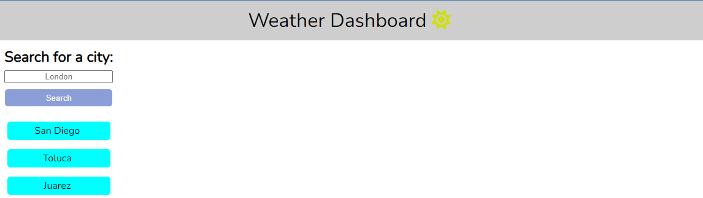

# 🌤️ Weather Dashboard 

## 📝 Description

This is a weather dashboard that runs in the browser and features dynamically updated HTML and CSS. It uses the 5 Day Weather Forecast API to retrieve weather data for cities.

## 🧳 User Story

AS A traveler,
I WANT to see the weather outlook for multiple cities,
SO THAT I can plan a trip accordingly.

## ✨ Features

1. 🔍 Search for a city to get current and future weather conditions.
2. 📝 The city you searched for is added to the search history.
3. 🌆 For each city, you'll see the name, the date, an icon representation of weather conditions, the temperature, the humidity, and the wind speed.
4. 🗓️ You'll also get a 5-day forecast that displays the date, an icon representation of weather conditions, the temperature, the wind speed, and the humidity.
5. 🔁 You can click on a city in the search history to view its current and future conditions again.

## 🚀 Setup

1. Clone the repository to your local machine.
2. Open the `index.html` file in your browser.

## 🎯 Usage

To use the Weather Dashboard, simply input the name of the city you wish to see the weather for in the search bar. The current and future weather conditions for that city will then be displayed on the screen.

## 📄 License

This project is licensed under the terms of the [MIT License](./LICENSE).
